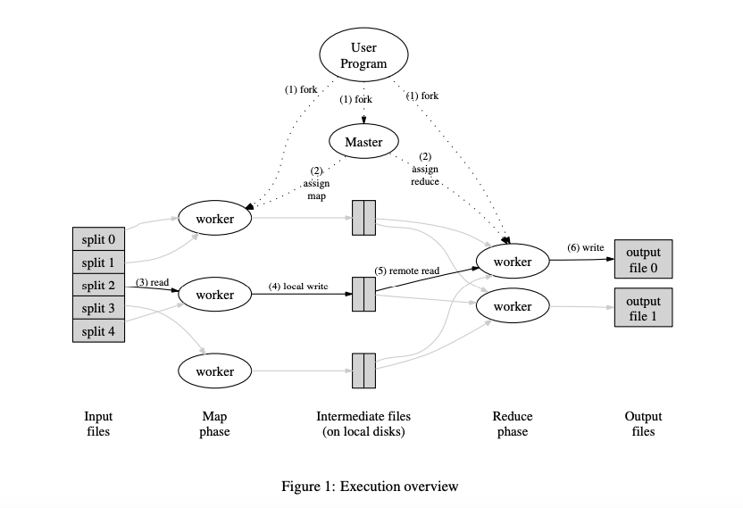

# MapReduce reading note

[MapReduce Paper(2004)](http://static.googleusercontent.com/media/research.google.com/en//archive/mapreduce-osdi04.pdf)

## Intro

Background:

Over the past five years, the authors and many others at Google **have implemented hundreds of special-purpose computations that process large amounts of raw data, such as crawled documents**, web request logs, etc., to compute various kinds of derived data, such as inverted indices, various representations of the graph structure of web documents, summaries of the number of pages crawled per host, the set of most frequent queries in a given day, etc. **Most such computations are conceptually straightforward**. However, **the input data is usually large and the computations** have to be distributed across hundreds or thousands of machines to finish in a reasonable amount of time. 

The issues of how to parallelize the computation, distribute the data, and handle failures conspire to obscure the original simple computation with large amounts of complex code to deal with these issues.

As a reaction to this complexity, we designed a new abstraction that allows us to express the simple computations we were trying to perform but **hides the messy details of parallelization, fault-tolerance, data distribution and load balancing in a library.**

MapReduce is a programming model and an associated implementation for processing and generating large data sets. **Users specify a map function** that processes a key/value pair to generate a set of intermediate key/value pairs, **and a reduce function** that merges all intermediate values associated with the same intermediate key. Many real-world tasks are expressible in this model, as shown in the paper.

**Map**: a function that processes a key/value pair to generate a set of intermediate key/value pairs.

**Reduce**: a function that merges all intermediate values associated with the same intermediate key.

Google build this MapReduce system includes matured data management, machine cluster management, failure tolerant and managing the inter-machine communication, which can help user to run their MapReduce job in a parallel and distributed system, allowing uses to easily utilize the resources of a large distributed system.

## Execution flow

The execution flow of MapReduce System ↑

1. The system split the input file into M pieces. Then it starts up many copies of the program(worker) on a cluster of machines.
2. One of the copies of the program is special – the master. The rest are workers that are assigned work by the master. There are M map tasks and R reduce tasks to assign
3. The woker receives a map task and reads and parses the key-valus out from assigned split files. It output the key-value sets to N reduce intermediate files. The intermediate key/value pairs produced by the Map function are buffered in memory.
4. Periodically, the buffered pairs are written to the local disk, and partitioned into R regions by the partitioning function. The locations of buffered pairs are passed back to the master.
5. The worker who receives a reduce task reads all the intermediate keys from intermediate files and then sorts them by key and writes the merging key-values to the output reduce the file. (System will have another task to summarise all of the reduced results)
6. When all map tasks and Reduce tasks have been completed, the master wakes up the user program.
7. Typically, users do not need to combine these R output files into one file – they often pass these files as input to another MapReduce call or use them from another distributed application that can deal with input that is partitioned into multiple files.

#### **Master Structures:**

The master keeps several data structures. For each map task and reduce task, it stores the state (idle, in-progress, or completed), and the identity of the worker machine (for non-idle tasks).

#### **Fault Tolerance:**

Since the MapReduce library is designed to help process very large amounts of data using hundreds or thousands of machines, the library must tolerate machine failures gracefully

##### **Master failure:** 

1. **Checkponits timemachine.** It is easy to make the master write periodic checkpoints of the master data structures described above. If the master task dies, a new copy can be started from the last checkpointed state. 
2. **Single master unlikely fail**. However, given that there is only a single master, its failure is unlikely; therefore our current implementation aborts the MapReduce computation if the master fails. Clients can check for this condition and retry the MapReduce operation if they desire.

##### **Worker failure:** 

The master will ping workers periodically. If no response is received from a worker in a certain amount of time, the master will mask the worker as failed and then re-assign the task to idle worker. 

Some noteworthy details are listed below. But the **common point is simply re-executed the task!** 

1. If worker A and worker B run the same task because worker A fail, the master will inform workers executing reduce tasks to be notified of the re-execution. All other workers will read the result from worker B.
2. MapReduce is resilient to large-scale worker failures. The MapReduce master simply re-executed the work done by the unreachable worker machines and continued to make forward the progress, eventually completing the MapReduce operation.
3. The MapReduce master simply re-executed the work done by the unreachable worker machines, and continued to make forward progress, eventually completing the MapReduce operation.

##### **Semantics in the Presence of Failures:**

1. **Resolution**. We rely on atomic commits of the map and reduce task outputs to achieve this property, i.e. rely on the atomic rename operation provided by the underlying file system to guarantee that the final file system state contains just the data produced by one execution of the reduce task. **(even though several workers are trying to rename the file, only one worker will be successful!)**
2. Map and reduce operators are deterministic => Semantics are equivalent to a sequential execution, in this case, makes it very easy to be understood
3. When the map and/or reduce operators are nondeterministic, we provide weaker but still reasonable semantics. Non-deterministic map/reduce's operators are like R1 and R1' generate different output, and R1 and R2 generate the same output...

#### Locality 

Network bandwidth is still a problem in the early 21 century: Network bandwidth is a relatively scarce resource in our computing environment.

So the master will distribute the task to the worker which is just nice in the machine which contains the replica of the input files if cannot, consider the to assign the task to the worker near that machine.

## More Use cases

**Distributed Grep**: 

- The map function emits a line if it matches a supplied pattern. 
- The reduce function is an identity function that just copies the supplied intermediate data to the output.

**Count of URL Access Frequency:** 

- The map function processes logs of web page requests and outputs hURL, 1i. 
- The reduce function adds together all values for the same URL and emits a hURL, total counti pair.

**Reverse Web-Link Graph:** 

- The map function outputs target, and sourcei pairs for each link to a target URL found on a page named source. 
- The reduce function concatenates the list of all source URLs associated with a given target URL and emits the pair: htarget, list(source)i

**Term-Vector per Host:** 

A term vector summarizes the most important words that occur in a document or a set of documents as a list of hword, frequencyi pairs. 

- The map function emits a hhostname, term vectori pair for each input document (where the hostname is extracted from the URL of the document). 
- The reduce function is passed all per-document term vectors for a given host. It adds these term vectors together, throwing away infrequent terms, and then emits a final hhostname, term vectori pair

## A significant use case: Large-Scale Indexing

One of our most significant uses of MapReduce to date has been a complete rewrite of the production indexing system that produces the data structures **used for the Google web search service**. The indexing system takes as input a large set of documents that have been retrieved by our crawling system, stored as a set of GFS files. The raw contents for these documents are more than 20 terabytes of data. The indexing process runs as a sequence of five to ten MapReduce operations. Using MapReduce has provided several benefits:

1. The indexing code is simpler, smaller, and easier to understand, because the code that deals with fault tolerance, distribution and parallelization is hidden within the MapReduce library.
2. The performance of the MapReduce library is good enough that we can keep conceptually unrelated computations separate, instead of mixing them to avoid extra passes over the data
3. The indexing process has become much easier to operate, becuase the system can delt with most of the problems caused by machine failure, slow machines, and networking hiccups.

## Takeaways

This paper is very near to reality, and quite useful for an entry-level software engineer to learn the actual details needed to be considered in the distributed system. 

There are lots of points that can not be ignored in real systems, such as failure, network connections down, and broken workers recovering after master discard its task. All of these accidents happened daily, but we still can build a robust system based on a good design that considers the possible conditions.

I spend lots of time to think how to design and implement the mapReduce master and worker. To my surprise, my codes passed all the tests including the failure tests after I just completed that codes to meet the basic requirements, which made me proud. Maybe I am starting to consider many accidents after realizing their existence, I think it's a great start at least :)

